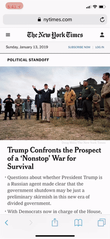
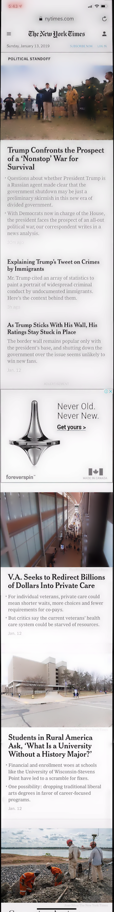

# Stitch It
Simple utility to create one large screenshot image for pages longer than can fit in the screen.

## Dependencies:
- `python3`
- `opencv3`

## Scripts
- `vid_stitch.py`: takes as input a mobile screen recording video of scrolling down a long page. Outputs one long screenshot
- `pic_stitch.py`: takes as input multiple consecutive screenshots (top to bottom) of a long page. Outputs one long screenshot

### Usage:
- `python vid_stitch.py -v my_screen_recording.mp4`
- `python pic_stitch.py -i my_screenshot1.png,my_screenshot2.png,my_screenshot3.png -o output.png`

### Options:
- `--output`/`-o`: output filename (optional). Default: `output.png`
for `vid_stitch.py` only:
- `--video`/`-v`: input video file with screen recording of scrolling down
- `--frame_step`/`-s`: size of step in video frames between each sample considered for stitching (optional). Default: `50`
From my experience, with a consistent, slow scrolling speed, you want to have about 10 images to stitch. So if the video has 1500 frames, the ideal `frame_step` would be around 150.
for pic_stitch.py` only:
- `--input`/`-i`: comma delimited (no spaces) input image files. Should be ordered top to bottom

### Example:
| Script               |                           Input                         |                                  Output                            |
| -------------------- | :------------------------------------------------------:| ----------------------------------------------------------------:  |
| `vid_stitch.py`      |  |  |
